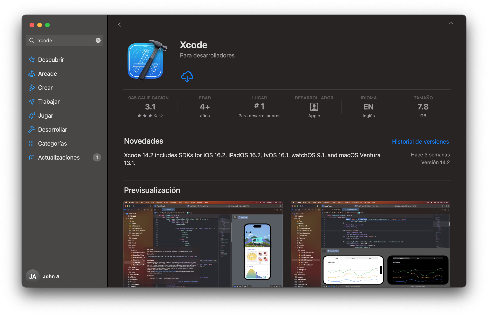
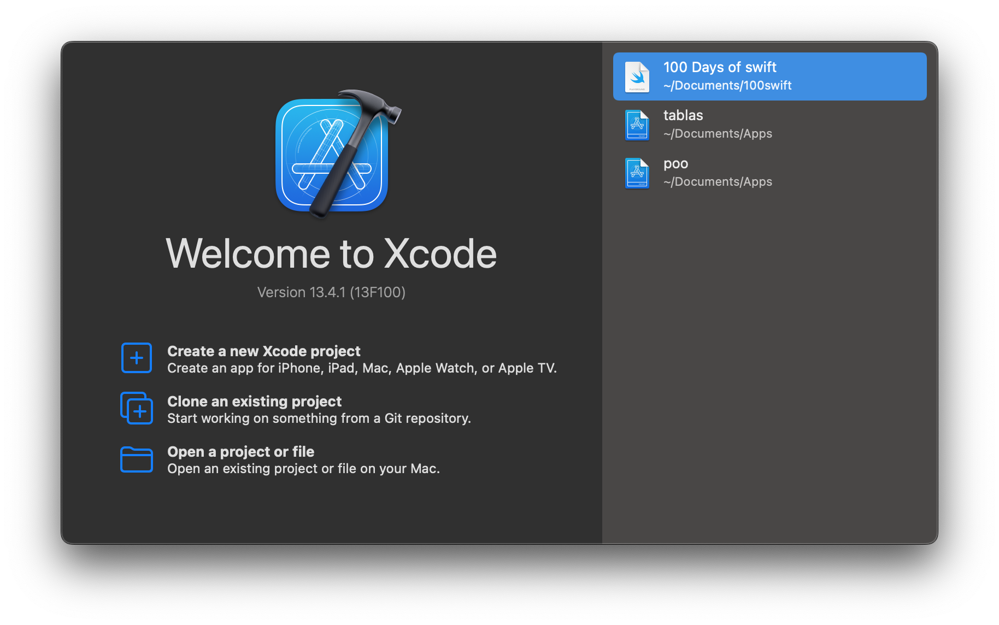
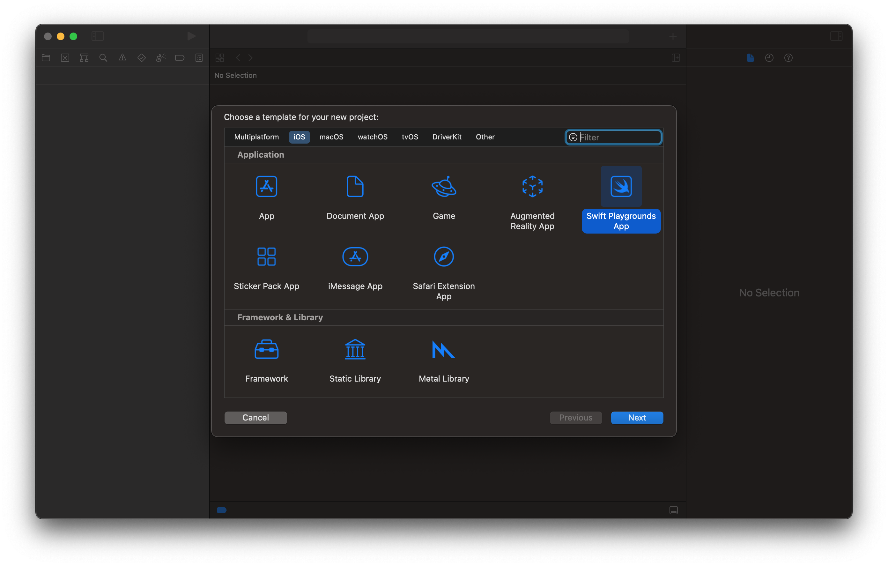
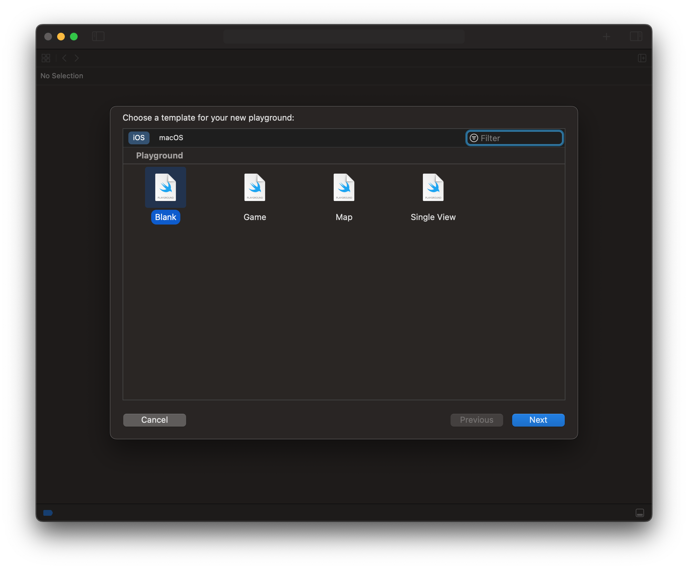
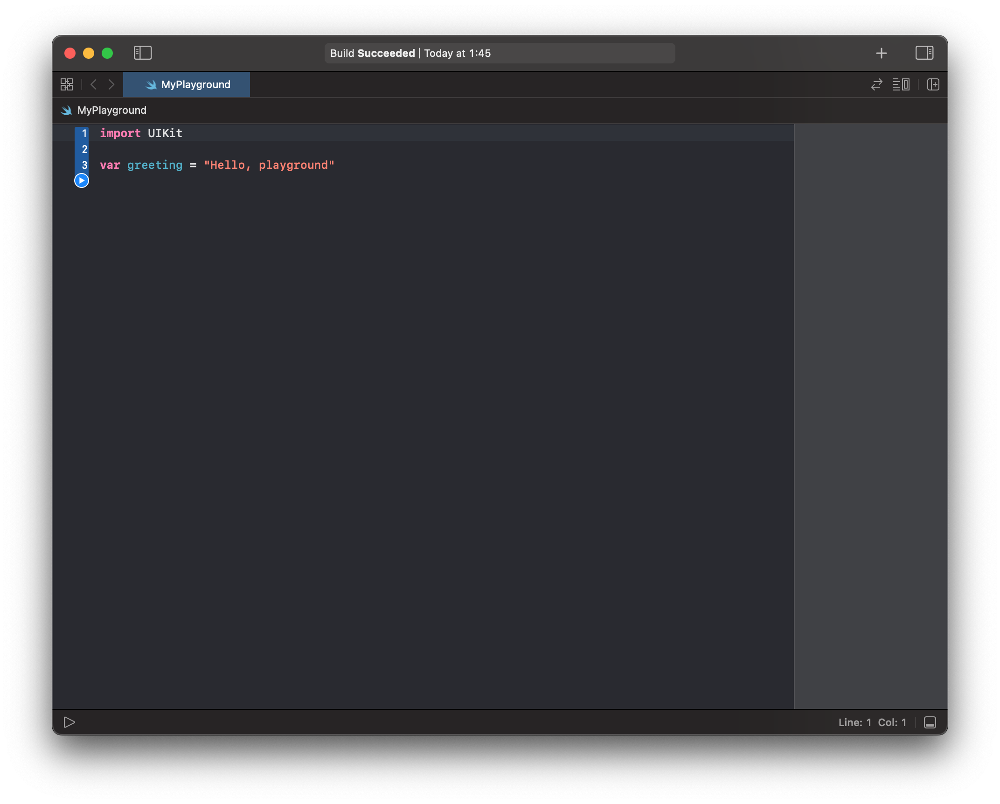
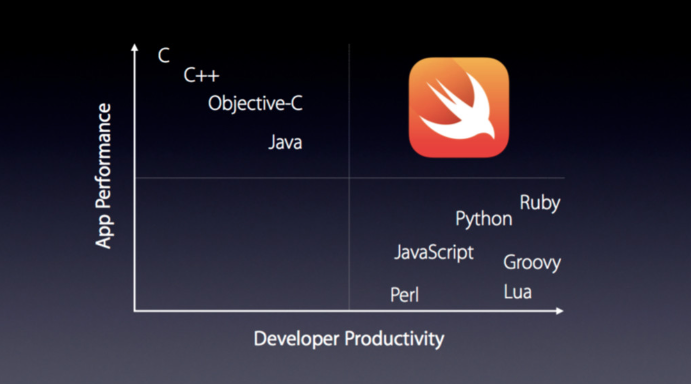

# Desarrollo en plataforma iOS
## Xcode

El desarrollo de aplicaciones se hará a través de un programa llamado Xcode, disponible en la Mac App Store o también está la posibilidad de descargarlo desde la página de desarrolladores de Apple. También se existe la posibilidad de programar en C (pero no es recomendable).




Antes que nada, es necesario que se cree una cuenta iCloud de Apple (tipo como en Play Store que se necesita un correo Gmail para poder descargar apps), iniciar sesión y podrás descargar Xcode. **Guarda ésta cuenta que desde ahora te servirá para todo, tu cuenta de desarrollador**.

Una vez descargado, si lo abres la primera vez verás una ventana parecida a ésta:



**Xcode incluye además, simuladores de dispositivos, por lo que no será necesario contar con un iPhone o iPad para probar tus apps, se recomienda tenerlo para pruebas mayores pero no es necesario actualmente**

## Playgrounds

En esta versión de Xcode se tiene que seleccionar la opción *Create a new Xcode proyect*. Lo que aparecerá es lo siguiente:



En la parte superior donde dice *File* hay que seleccionar ahí y después ahí dice *New*. A continuación se desplegará un menú donde ahí aparecerá la opción *Playground*. O también se puede evitar todo los pasos anteriores usando la combinación de teclas  ⌥⇧⌘N. A continuación aparecerá la siguiente ventana



A continuación se escogerá la opción de *black*. Pero primero hablemos de los Playgrounds, en pocas palabras se puede resumir que es una hoja de texto (como sublime) pero con herramientas extras para hacer pruebas, como dice el nombre, jugar, cone el lenguaje de programación que se usa para desarrollar en iOS: Swift,

Una vez iniciado, picando el primer botòn y obteniendo una playground podràs aprender todo lo que se referente a la sintaxis de la programación, incluso desarrollar apliaciones de realidad aumentada (VR) con un sólo código. Es nuetro cajón de arena para aprender Swift.


Un playground luce así: 




<p>
  
</p>

## El lenguaje de programación Swift

Dicen las por ahí que trabajar antes de en desarrollo iOS era muy complejo y la razón principal, dice muchos era el lenguaje de programación: Objetive-C. Aquì es donde entra Swift en escena.

Swift es un lenguaje de programación multiparadigma creado por Apple enfocado en el desarrollo de aplicaciones para iOS y macOS. Fue presentado en WWDC 2014 y está diseñado para integrase con los Frameworks Cocoa y Cocoa Touch, puede usar cualquier biblioteca programa en Objetive-C y llamar a funciones de C. También es posible desarrollar código en Swift compatible con Objetive-C bajo ciertas condiciones. Swift tiene la intención de ser un lenguaje seguro, de desarrollo rápido y conciso. Fue presentado cocomo un lenguaje propietario, pero en el año 2015, con la versión 2.2 pasó a ser código abierto.

Swift facilita la comprensión de código mediante una sintaxis tan amable como Python, además de diversos agregados como los llamados "Azucar sintáctico" que son palabras agregas al código para que la comprensión del mismo sea como leer un libro o manual de acciones.

Objetive-C
```objc

const int cout = 10;
double price = 23.55;

NSString *fistMessage = @"Swift is awsome";
NSString *secondMessage = @"What do you think?";
NSString *message = [NSString stringWithFormat:@"%@%@", firstMessage, secondMessage];

NSLog(@"%@",message);
```
Swift
```swift
let cout = 10
var price = 23.55

let fistMessage = "Swift is awesome. "
let secondMessage = "What do you think?"
var message = fistMessage + secondMessage

print(message)
```

**Rendimiento**

Hay que entender un concepto clave: entre más humano sea el lenguaje, más tiempo tarda la computadora para entenderlo mientras es traducido, y viceversa, si tenemos un código objeto, para la computadora es directamente hablarle en 0 y 1's pero para nosotros leer eso es un caos total. Por ello la gráfica siguiente:



Los lenguajes de programación como Java, C++, C, Objective-C son muy agresivos y con una curva de aprendizaje muy elevada pero tienen un rendimiento muy superior a cualquier otro lenguaje por lo cercano a ser código máquina. En cambio lenguajes como Python, Ruby, Perl, JS son más comprensibles y más sencillos de aprender pero para desarrollo de cosas pesadas o que el tiempo es lo más vital, el rendimiento les falla por todas las traducciones hasta llegar a código máquina. 

Swift promete contener lo mejor de ambos mundos. Tener una sintaxis amable con el usuario y sin comprometer al preformance. Es más, es 2.6x más rápido que Objective-C.

Tanto así que existe por ahí un proyecto de un Framework para desarrollo de redes neuronales llamado **TENSORFLOW**

Los que hayan trabajado con desarrollo de inteligencia artificial, machine learning, y conceptos de ciencia de datos conocerán este magno proyecto ofrecido por Google.
